# Nested Document Topology Benchmark

`DocumentTopologyBench` is a dependency-free nested `1 → M → 1` reference. A document expands into pages, each page expands into a variable number of TableJobs, tables reduce to pages, and pages reduce to documents. Generated inputs intentionally include pages with zero tables to verify that empty groups complete correctly.

## Topology

```mermaid
flowchart LR
    Doc["Document"] --> Parse["ParseDocuments"]
    Parse --> ExpandPage["F.expand"]
    ExpandPage --> Page["Page Domain"]
    Page --> Layout["LayoutPages"]
    Layout --> OCR["OcrPages"]
    OCR --> Post["PostprocessPages"]
    Post --> ExpandTable["F.expand"]
    ExpandTable --> Job["TableJob Domain<br/>may be empty"]
    Job --> Table["TableCore"]
    Table --> ReduceTable["F.reduce<br/>TableJob → Page"]
    ReduceTable --> PageAssemble["ReducePage"]
    PageAssemble --> ReducePage["F.reduce<br/>Page → Document"]
    ReducePage --> DocAssemble["ReduceDocument"]
```



## Run

```python
from rayorch.benchmark import DocumentTopologyBench

report = DocumentTopologyBench(
    output_dir="./results",
    document_count=8,
    pages_per_document=6,
    tables_per_page=2,
    workers=4,
    batch_size=8,
    input_batch_size=1,
    max_active_input_batches=4,
).run(profile=False)
```

Inputs and outputs are deterministic and require no external files, models, or GPUs, making this the preferred case for installation checks, Ray-cluster connectivity, and scheduling regression.

## Outputs and metrics

Each output contains the document name, ordered page IDs, and ordered table IDs per page. Added metrics are total `pages` and `tables`.

## What performance it demonstrates

| Observation | Experiment | Question answered |
| --- | --- | --- |
| framework and scheduling overhead | hold total Grains constant, inspect wall time and RPC count | cost of the runtime when UDF work is nearly free |
| nested expansion scale | increase pages and tables | how scheduling cost grows across two dynamic Domains |
| empty-group path | retain generated zero-table pages | whether empty membership reduces immediately without deadlock |
| active-input window | scan `max_active_input_batches` | whether more concurrent documents improve batching and overlap |
| Worker scaling | scan `workers` and `batch_size` | when lightweight work becomes dominated by actor and RPC overhead |

This case measures correctness and control-plane overhead, not production document-processing throughput. Because UDFs are intentionally light, adding Workers may make it slower; that result usefully exposes scheduling cost when tasks are too fine-grained.
