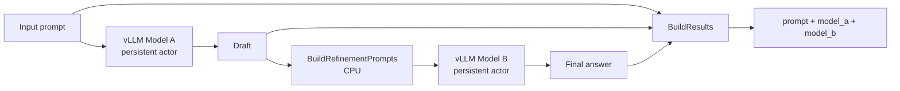

# Dual vLLM Benchmark

`DualVllmBench` connects two persistent vLLM engines in one explicit Pipeline. Model A generates a draft, a CPU stage constructs a refinement prompt, and Model B generates the final answer. This represents review, rewriting, verification, or model cascades without hiding two model calls inside one UDF.

## Topology



Both model actors remain resident. With `tensor_parallel_size=N`, each actor requests N GPUs, so the default graph needs `2 × N` GPUs. They remain separate engine instances even when both paths point to the same model.

## Run

`input_path` can be a text file with one prompt per line, or JSONL containing strings or objects with a `prompt` field:

```python
from rayorch.benchmark import DualVllmBench

bench = DualVllmBench(
    input_path="/shared/prompts.jsonl",
    output_dir="/shared/dual-vllm-output",
    model_a="/shared/models/model-a",
    model_b="/shared/models/model-b",
    input_limit=100,
    tensor_parallel_size=1,
    batch_size=8,
    input_batch_size=32,
    max_active_input_batches=1,
    max_tokens=128,
)

report = bench.run(ray_address="auto")
```

If models should run on different nodes or Conda environments, override `stage_options["model_a"]` and `stage_options["model_b"]` independently.

## Outputs and metrics

Each output contains the original `prompt`, the `model_a` draft, and the `model_b` final answer. Added metrics are `prompts`, `model_a_characters`, and `model_b_characters`.

## What performance it demonstrates

| Observation | Where to read it | Question answered |
| --- | --- | --- |
| end-to-end prompt throughput | `prompts / measured_wall_s` | requests per second through both generation stages |
| stage share | compare `model_a`, `prompt`, and `model_b` Call time | which model or intermediate stage dominates |
| model batching | RPC, Grain, and batch statistics for both model Calls | whether both engines receive sufficiently full batches |
| startup cost | compare `startup_s` with `measured_wall_s` | impact of loading two models on one-shot jobs |
| output work | generated character counts | explain timing changes under identical tokenizer and generation settings, but not replace tokens/s |

Because Model B depends on each result from Model A, this graph demonstrates pipeline parallelism across inputs rather than parallel execution inside one request. Hold prompts, `max_tokens`, temperature, model revisions, and tensor parallel settings constant when comparing runs.
