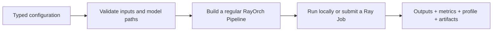

# Benchmarks Overview

A RayOrch Benchmark is not a second execution framework. It packages a regular `Pipeline` as a configurable, repeatable, submit-ready experiment with standard results. Every built-in follows the same path: construct typed configuration, load inputs, create the Pipeline, run against Ray locally or through Ray Jobs, and emit a `BenchmarkReport`.



## Choose a workload

| Benchmark | Type | Core topology | What to observe |
| --- | --- | --- | --- |
| [`MinerUBench`](mineru.md) | Real model | PDF → Page → MinerU → Document | page throughput, multi-GPU scaling, cross-PDF batching, ordered reconstruction |
| [`YoloSamBench`](yolo-sam.md) | Real model | Image → YOLO → SAM → Save | balance between persistent model pools, stage bottlenecks, end-to-end image throughput |
| [`DualVllmBench`](dual-vllm.md) | Real model | Prompt → vLLM A → vLLM B | two-engine composition, model-stage time, batching efficiency |
| [`SglangVllmBench`](sglang-vllm.md) | Real model | Prompt → SGLang → vLLM | cross-Conda scheduling overhead and stability |
| [`DocumentTopologyBench`](document-topology.md) | Dependency-free topology | Document → Page → TableJob → Document | two dynamic fan-outs, empty groups, ordered reduction, scheduler overhead |
| [`VideoCaptionTopologyBench`](video-caption.md) | Dependency-free topology | Video → Frame → Caption → Video | `1 → M → 1`, cross-video batching, frame-level parallelism |
| [`VideoMultimodalTopologyBench`](video-multimodal.md) | Dependency-free topology | Video → Audio + Frame → Merge | independent heterogeneous branches joined by parent lineage |

Use the real-model cases to study complete workloads. The three topology references use deterministic UDFs and need no dataset, model, or GPU, making them suitable for first runs, CI, scheduling-semantics regression, and framework-overhead experiments. They are not production Docling, VLM, or ASR adapters.

## Shortest path

```python
from rayorch.benchmark import DocumentTopologyBench

report = DocumentTopologyBench(output_dir="./results").run(profile=False)
report.print_summary()
```

Importing `rayorch.benchmark` does not import vLLM, SGLang, MinerU, or vision-model dependencies. The registry stores class paths and loads an implementation only when that Benchmark is used.

## What the report can answer

Every run records `startup_s`, `measured_wall_s`, `end_to_end_wall_s`, actor and RPC counts, peak active input batches, and per-Call Grain, batch-size, and execution-time statistics. Workloads add business work such as pages, frames, detections, masks, or generated character counts. Read [Interpret Performance Results](performance.md) before treating workload counts as throughput or driver-visible GPU samples as cluster-wide monitoring.

## Next steps

- First run: [Run a Benchmark](run.md)
- Understand results: [Interpret Performance Results](performance.md)
- Publish an experiment: [Write a Benchmark](write.md)
