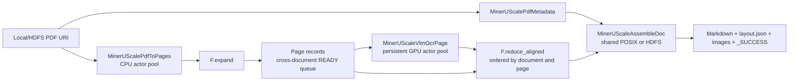

# MinerU Scale Benchmark — Real Workload

> **Real workload:** `MinerUScaleBench` renders real PDF files, loads the real
> MinerU 2.5 model in persistent vLLM GPU actors, performs page inference, and
> writes real Markdown, layout JSON, extracted images, and document commit
> markers. It is not a synthetic topology or scheduler-only benchmark.

`MinerUScaleBench` is the large-scale version of
[`MinerUBench`](mineru.md): both express the PDF → Page → OCR → Document
relation, while the Scale version strengthens input handling, actor
initialization, output commit, and resource configuration for long-running
local multi-GPU and multi-node GPU jobs.

## What the scale version adds

| Capability | Behavior |
| --- | --- |
| local and HDFS inputs | accepts one or more PDF files/directories or `hdfs://` roots, with deterministic discovery and duplicate-stem rejection |
| resilient rendering | retries PDF reads and refreshes cached HDFS filesystem clients |
| node-safe vLLM actors | serializes vLLM initialization on each node and assigns non-overlapping port blocks |
| fractional GPU layouts | exposes both OCR replica count and GPU reservation per actor |
| atomic output | publishes `_SUCCESS` only after Markdown, layout JSON, and images are complete |
| resume | validates committed documents and reuses them on rerun |
| reproducible reports | records configuration, actor/RPC/batch metrics, document/page counts, failures, and throughput |
| direct CLI | runs without editing RayOrch or workload source constants |

## Topology



Pages from different PDFs may share an OCR RPC. This cross-document packing is
the main reason to keep multiple input batches active: model actors can consume
READY pages without waiting for every page of one PDF.

## Prerequisites

- a Ray cluster with GPU nodes and enough CPUs for all persistent actor pools;
- the MinerU model visible at the same path on every eligible GPU node;
- Flash-MinerU importable as `flash_mineru` in every actor;
- vLLM, `mineru-vl-utils`, Pillow, and the dependencies in the workload's
  `env.json`;
- PyArrow and working HDFS client configuration for `hdfs://` inputs or output;
- a shared POSIX/Ceph path or HDFS URI for business output and a path visible to
  the driver for Benchmark reports.

The Benchmark does not download the model or dataset and does not create a Ray
cluster. Prepare those resources before running the command.

## Run directly

The same entry point works for a local Ray instance or an existing cluster:

```bash
python -m rayorch.benchmarks.mineru_scale \
  --input /shared/pdfs \
  --model /shared/models/MinerU2.5-2509-1.2B \
  --output /shared/results/mineru-scale \
  --artifact-dir /shared/results/mineru-scale-reports \
  --ray-address auto
```

Repeat `--input` to combine multiple roots. Use `--input-limit` for a smoke or
screening run. A fresh output directory is recommended for every performance
candidate so resume does not change the amount of output work.

### 4×H20 experiment

This conservative layout uses one OCR actor per 96-GB H20:

```bash
python -m rayorch.benchmarks.mineru_scale \
  --input /shared/pdfs \
  --input-limit 48 \
  --model /shared/models/MinerU2.5-2509-1.2B \
  --output /shared/results/mineru-scale-4h20 \
  --artifact-dir /shared/results/mineru-scale-4h20-reports \
  --render-replicas 16 \
  --ocr-replicas 4 \
  --assemble-replicas 4 \
  --batch-size 64 \
  --input-batch-size 24 \
  --max-active-input-batches 3 \
  --gpu-memory-utilization 0.8 \
  --gpus-per-ocr-actor 1 \
  --ray-address auto
```

One real local validation processed 48 PDFs / 867 pages on 4×H20 with no
failed documents:

| Metric | Observed value |
| --- | ---: |
| completed documents | 48 / 48 |
| pages | 867 |
| measured pipeline wall | 136.860 s |
| page throughput | 6.335 pages/s |
| OCR RPCs | 18 |
| average OCR pages/RPC | 48.17 / 64 |
| OCR batch fill | 75.26% |
| actor/model startup | 551.215 s |

The run used Ray 2.58.0, vLLM 0.10.0, Torch 2.7.1, and
`mineru-vl-utils` 1.2.1.

## Reference 64-GPU defaults

The default constructor records the completed 8-node × 8-H20 experiment shape:

| Parameter | Default |
| --- | ---: |
| `render_replicas` | 256 |
| `ocr_replicas` | 128 |
| `gpus_per_ocr_actor` | 0.5 |
| total OCR GPU reservation | 64 |
| `assemble_replicas` | 64 |
| `batch_size` | 64 pages |
| `input_batch_size` | 24 PDFs |
| `max_active_input_batches` | 24 |
| `gpu_memory_utilization` | 0.32 |
| `render_dpi` | 200 |

The reference run processed 3,690 PDFs / 174,744 pages at 48.1738 pages/s and
reported one failed document. It used Ray 2.51.1, vLLM 0.11.0, Torch
2.8.0+cu128, PyArrow 19.0.1, and 64 H20 GPUs. The exact provenance is stored in
`success_contract.json` next to the Benchmark implementation.

The default actor plan requests 449 actor CPUs
(`256 + 128 + 64 + 1`). If the cluster cannot admit that plan, reduce render
and assemble replicas before launching; Ray will otherwise leave actors pending
rather than silently shrinking the pools.

## Python API

```python
from rayorch.benchmark import MinerUScaleBench


bench = MinerUScaleBench(
    input_paths=(
        "hdfs://namenode/path/to/pdfs-a",
        "hdfs://namenode/path/to/pdfs-b",
    ),
    model="/shared/models/MinerU2.5-2509-1.2B",
    output_dir="/shared/results/mineru-scale",
    artifact_dir="/shared/results/mineru-scale-reports",
    render_replicas=256,
    ocr_replicas=128,
    gpus_per_ocr_actor=0.5,
    assemble_replicas=64,
    batch_size=64,
    input_batch_size=24,
    max_active_input_batches=24,
    gpu_memory_utilization=0.32,
)

report = bench.run(ray_address="auto")
report.print_summary()
```

`submit()` is also available through the standard Benchmark API. Input, model,
output, and artifact paths must be visible in the execution environment; source
upload does not upload those large assets.

## Output and resume protocol

Each document is written below:

```text
<output>/<pdf-stem>/
  _SUCCESS
  vlm/
    <pdf-stem>.md
    layout.json
    images/
```

A document is complete only when `_SUCCESS` is valid. Local/shared-filesystem
writes use `.rayorch-incomplete` during assembly. HDFS writes use a staging
directory followed by a move into the final location. A rerun validates the
commit and reuses complete documents.

Standard reports are written to:

```text
<artifact-dir>/<run-id>/
  config.json
  summary.json
  gpu_samples.jsonl
```

`summary.json` adds `documents`, `failed_documents`, `pages`, and
`pages_per_s` to the common Benchmark metrics.

## Parameter-setting recommendations

Tune in this order:

1. validate one or two PDFs;
2. fit OCR actors to GPU count and memory;
3. sweep `batch_size`—normally 32, 64, 96, then 128;
4. increase `max_active_input_batches` until OCR packing stops improving;
5. increase render replicas only when OCR waits for pages;
6. tune assemble replicas against the real shared filesystem.

The Benchmark directory includes a `mineru-scale-tuning` Codex Skill and a
deterministic parameter recommender. Note that its recommended parameters are
not necessarily optimal; they are estimates based on historical testing
experience.
