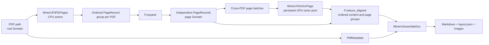

# MinerU PDF Benchmark

`MinerUBench` is the most complete real-model workload included with RayOrch. A PDF dynamically expands into a variable number of pages, CPU actors render them, persistent GPU actors run MinerU 2.5 with vLLM, and page results are reconstructed by PDF and page index before writing Markdown, layout JSON, and images—even when physical completion is out of order.

## Topology



This is not a simple loop over PDFs. Documents with different lengths progress independently: any READY pages may form a cross-PDF model batch, and a PDF enters assembly as soon as all of its own pages finish.

## Run

The input can be one PDF or a directory. Model, input, and output paths must be visible at the same location on every Ray node eligible to execute the stages.

```python
from rayorch.benchmark import MinerUBench

bench = MinerUBench(
    input_path="/shared/pdfs",
    output_dir="/shared/mineru-output",
    model="/shared/models/MinerU2.5",
    input_limit=100,
    num_gpus=8,
    batch_size=64,
    input_batch_size=24,
    max_active_input_batches=3,
)

report = bench.run(ray_address="auto")
report.print_summary()
```

Override uncommon stage settings without editing the workload:

```python
bench = MinerUBench(
    input_path="/shared/pdfs",
    output_dir="/shared/mineru-output",
    model="/shared/models/MinerU2.5",
    num_gpus=8,
    stage_options={
        "render": {"replicas": 4, "num_cpus": 2},
        "ocr": {"batch_size": 32},
        "assemble": {"replicas": 2},
    },
)
```

## Outputs and metrics

Each output record contains `pdf`, `md_path`, `chars`, and `pages`. Workload artifacts are under `output_dir/<pdf>/vlm/`, and standard reports are under `output_dir/.rayorch-benchmark/<run-id>/`. In addition to common execution metrics, the report provides `pages` and `pages_per_s`.

## What performance it demonstrates

| Observation | Where to read it | Question answered |
| --- | --- | --- |
| page throughput | `metrics.pages_per_s` | how many pages the complete PDF pipeline finishes per second |
| GPU scaling | hold data and batch fixed, vary `num_gpus` | whether more persistent OCR actors provide near-linear gains |
| model batching | OCR Call RPC, Grain, and batch statistics | whether there is enough page work and active input window to fill model batches |
| CPU/GPU balance | compare render, OCR, and assemble Call time | whether rendering or assembly starves GPUs, or OCR dominates |
| variable-document scheduling | mix short and long PDFs and inspect completion behavior | whether completion-driven execution prevents short PDFs from waiting behind long ones |

A useful experiment holds the PDF set constant and scans `batch_size`, `max_active_input_batches`, and `num_gpus`. Warm up, repeat each point, and report medians. Shared-storage bandwidth, page dimensions, model version, and GPU type materially affect results and must accompany published numbers.
