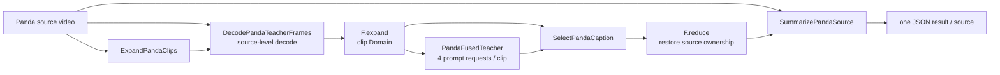

# Panda-70M Video Caption Benchmark

`Panda70MBench` packages the Panda-70M validation caption workload as a
RayOrch Benchmark. A source video keeps ownership of its clips, four temporal
frames are decoded for every clip, one fused Qwen2.5-VL teacher produces four
caption candidates, and the selected clip results are reduced back to the
source video.

The implementation lives in the
[`rayorch/benchmarks/panda70m`](https://github.com/OpenDCAI/RayOrch/tree/udf/video/rayorch/benchmarks/panda70m)
package. The package contains ordinary UDFs, a declarative Pipeline, a typed
Benchmark entry point, and a Ray Jobs environment manifest.

## Topology



`DecodePandaTeacherFrames` receives a source and its clip group together, so a
shared source file is opened once per decode call. `F.expand` then gives every
decoded clip its own scheduling identity. The four prompt positions are packed
into one vLLM request batch by `PandaFusedTeacher`; each actor keeps one model
instance for subsequent batches.

## Manifest

The manifest is a JSON object with a `sources` array. Each source needs a stable
`source_id` and a non-empty `clips` array. Clip records use an ordered
`clip_index` and a shared media `path`:

```json
{
  "sources": [
    {
      "source_id": "video-0001",
      "clips": [
        {
          "clip_index": 0,
          "path": "/shared/videos/video-0001.mp4",
          "clip_start_fraction": 0.0,
          "clip_end_fraction": 1.0,
          "reference_caption": "a person opens a door"
        }
      ]
    }
  ]
}
```

`clip_start_fraction` and `clip_end_fraction` select the temporal interval used
for the four teacher frames. `reference_caption` is optional; when present,
the output records reference F1 diagnostics. A clip can use an `hdfs://` path.
Set `RAYORCH_DEFER_LOCAL_PATH_CHECK=1` when the manifest is visible to the
driver while video data is mounted only on worker nodes.

## Run locally or on an existing Ray cluster

```python
from rayorch.benchmark import Panda70MBench

bench = Panda70MBench(
    manifest="/shared/panda70m/val.audit.json",
    output_dir="/shared/results/panda70m",
    model="Qwen/Qwen2.5-VL-7B-Instruct",
    input_limit=100,
    teacher_batch_size=8,
    teacher_replicas=2,
    decode_replicas=4,
    decode_backend="opencv",
    long_edge=448,
    input_batch_size=2,
    max_active_input_batches=2,
)

report = bench.run(ray_address="auto", profile=True)
report.print_summary()
```

Each teacher actor requests one GPU. With `teacher_replicas=2`, the fused
teacher stage creates eight persistent GPU actors, one for every combination
of four prompt positions and two replicas. Every worker must see the model
weights and the media paths.

For a local smoke run, use a small manifest and `profile=False`. The model,
video files, CUDA runtime, and dependencies from `env.json` are still required.

## Submit through Ray Jobs

```python
from rayorch.benchmark import LocalSource

run = bench.submit(
    "http://ray-head:8265",
    source=LocalSource(
        project_root="/path/to/RayOrch",
        modules=("/path/to/RayOrch/rayorch",),
    ),
)
report = run.wait(timeout_s=3600)
```

The submission installs the packages declared by
[`env.json`](https://github.com/OpenDCAI/RayOrch/blob/udf/video/rayorch/benchmarks/panda70m/env.json)
when `LocalSource.install_dependencies` is enabled. Inputs, model weights,
outputs, and the report directory remain on shared storage.

## Parameters

| Parameter | Meaning |
| --- | --- |
| `teacher_batch_size` | Clip records admitted to one fused teacher batch |
| `teacher_replicas` | Replica count for each of the four prompt positions |
| `decode_replicas` | CPU decode actor replicas |
| `decode_backend` | `opencv` for local or materialized HDFS media, `pyav` for random-access streams |
| `long_edge` | Maximum decoded-frame edge passed to the VLM |
| `input_batch_size` | Source videos admitted in one input lifecycle |
| `max_active_input_batches` | Number of overlapping source lifecycles |
| `sample_multiplier` | Number of deterministic manifest passes used for scaling experiments |
| `stage_options` | Per-stage Ray options for `expand`, `decode`, `teacher`, `select`, or `summarize` |

The default selector is reference-free: it scores caption length and token
diversity. Reference captions provide diagnostics and do not participate in
selection.

## Outputs and metrics

The standard report is written below:

```text
<output_dir>/.rayorch-benchmark/<run-id>/
  config.json
  summary.json
  gpu_samples.jsonl
```

`SummarizePandaSource` also writes one JSON file per source under
`output_dir`. Each file contains ordered clip selections, the chosen role and
caption, the candidate captions, and the chosen/oracle reference F1 values
when references are available. The report adds `sources`, `clips`,
`mean_chosen_reference_f1`, and `mean_oracle_reference_f1` to the common
RayOrch metrics.

The reference F1 values describe lexical overlap for experiment diagnostics.
They do not replace a recognized video-caption quality benchmark.
