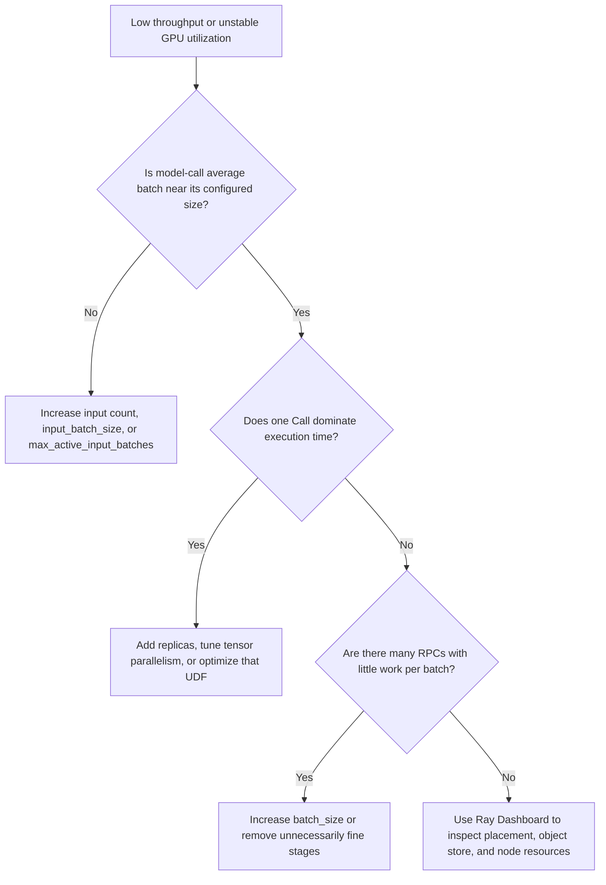

# Interpret Performance Results

A Benchmark should provide more than one wall-clock number. It places business work, RayOrch scheduling behavior, and resource samples in one report so you can determine whether the bottleneck is model execution, batching, actor count, the active-input window, or the topology itself.

## Common metrics

| Field | Meaning | Typical interpretation |
| --- | --- | --- |
| `startup_s` | time to create the Executor and actors and load models | analyze separately from steady execution for large models |
| `measured_wall_s` | time spent inside `Executor.run()` | preferred denominator for throughput |
| `end_to_end_wall_s` | total time from Executor creation to completion | reflects user-visible latency for a one-shot job |
| `actor_count` | actors created for the graph | verify that replica configuration matches intent |
| `rpc_count` | total Worker RPCs | many RPCs with small average batches usually indicate insufficient batching or input window |
| `peak_active_input_batches` | maximum concurrently active source batches | shows whether `max_active_input_batches` widened the pipeline window |
| `calls` | per-Call actor, RPC, Grain, batch, and execution-time statistics | find the dominant stage, batch fill, and stage imbalance |
| `released_values` | intermediate values released early by the runtime | describes value lifecycle, not bytes saved |

## Compute workload throughput

Use a workload unit over execution time:

```text
workload throughput = completed workload units / measured_wall_s
```

MinerU reports `pages_per_s` directly. YOLO → SAM can use `images / measured_wall_s`, and video cases can use `frames / measured_wall_s`. The LLM examples currently record characters rather than tokens, so they support only rough comparisons under the same tokenizer and generation settings and must not be presented as standard tokens/s.

## Hold these constant when comparing runs

- identical input set, ordering, and `input_limit`;
- identical model, precision, CUDA/driver, backend version, and generation settings;
- identical Ray nodes and GPU type;
- identical `batch_size`, `input_batch_size`, `max_active_input_batches`, and replica counts unless one is the experimental variable;
- a warm-up policy, or separate reporting for cold start and steady state;
- repeated runs with median or percentile reporting instead of one best run.

## Find a bottleneck



## Profile boundary

`gpu_samples.jsonl` is best-effort sampling of GPUs visible to the driver. It is useful for a quick view of memory peaks and coarse utilization trends, but it is not multi-node cluster monitoring and does not attribute samples to individual actors. Use Ray Dashboard, Prometheus/Grafana, or your deployment platform for node- and process-level observation.

## Reporting rule

“What performance this Benchmark demonstrates” means the dimensions it can measure and expose, not a promised throughput number. Real results must state hardware, software versions, model, data, parameters, and repetition count. The dependency-free topology cases primarily measure scheduling correctness and framework overhead, not production model throughput.
