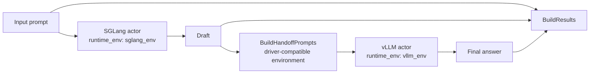

# SGLang → vLLM Cross-environment Benchmark

`SglangVllmBench` is the smallest real-model example of cross-environment execution. SGLang and vLLM run in separate Conda environments and persistent actors, while RayOrch passes ordinary Python values between stages without requiring both inference backends to share one dependency stack.

## Topology



There is no private RayOrch environment registry: `sglang_env` and `vllm_env` become Ray-native `runtime_env={"conda": ...}` settings. Both environments must exist on eligible nodes and contain compatible Python, Ray, RayOrch, and their respective inference backend.

## Run

```python
from rayorch.benchmark import SglangVllmBench

bench = SglangVllmBench(
    input_path="/shared/prompts.jsonl",
    output_dir="/shared/sglang-vllm-output",
    model="/shared/models/Qwen3-0.6B",
    sglang_env="rayorch-sglang",
    vllm_env="rayorch-vllm",
    input_limit=100,
    sglang_tensor_parallel_size=1,
    vllm_tensor_parallel_size=1,
    batch_size=8,
    max_tokens=128,
)

report = bench.run(ray_address="auto")
```

When submitting a source checkout through Ray Jobs, prepare dependencies in both actor environments and use `LocalSource(..., install_dependencies=False)` so the driver environment does not attempt to install SGLang and vLLM together.

## Outputs and metrics

Each output contains `prompt`, the SGLang draft, and the vLLM final answer. Added metrics are `prompts`, `sglang_characters`, and `vllm_characters`.

## What performance it demonstrates

| Observation | Where to read it | Question answered |
| --- | --- | --- |
| cross-environment throughput | `prompts / measured_wall_s` | requests per second through two isolated software stacks |
| environment and model cold start | `startup_s` | impact of Conda actor initialization and model loading on one-shot runs |
| stage bottleneck | compare SGLang and vLLM Call time and batch statistics | which backend limits throughput and whether TP settings are balanced |
| environment-boundary overhead | compare with a same-environment two-engine baseline | additional startup or transfer cost from `runtime_env` isolation |
| stability | repeat runs and inspect failures and completed outputs | whether actors from different stacks start and recover reliably across nodes |

This case first validates that one Pipeline works across two real environments, and only then compares backend speed. For a fair boundary-overhead experiment, use the same model and prompts and report model loading, first compilation, and steady execution separately.
