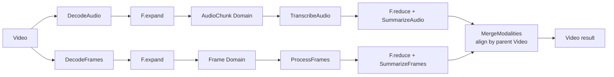

# Video Multimodal Topology Benchmark

`VideoMultimodalTopologyBench` demonstrates two sibling branches under one parent Video. The audio branch expands into AudioChunks and the vision branch into Frames. They have different cardinalities and progress independently, then each reduces to the Video Domain before the final merge.

## Topology



## Run

```python
from rayorch.benchmark import VideoMultimodalTopologyBench

report = VideoMultimodalTopologyBench(
    output_dir="./results",
    video_count=8,
    frames_per_video=16,
    audio_chunks_per_video=6,
    workers=4,
    batch_size=8,
    input_batch_size=1,
    max_active_input_batches=4,
).run(profile=False)
```

## Outputs and metrics

Each output contains a video name, ordered audio chunk IDs, and ordered frame IDs. Added metrics are `audio_chunks` and `frames`.

## What performance it demonstrates

| Observation | Experiment | Question answered |
| --- | --- | --- |
| branch parallelism | independently increase audio and vision work | whether sibling Domains progress independently instead of serializing |
| branch imbalance | use different chunk/frame ratios | how the slower branch determines final merge readiness |
| parent join | increase video count and input window | whether videos complete and merge independently by lineage |
| scheduling overhead | compare with the single-branch video case | control-plane cost of adding a second Domain, reduction, and join |

This case studies DAG shape and join behavior, not production ASR or VLM throughput. After replacing UDFs with real models, configure resources, batches, and environments per branch and report the work performed by each modality.
