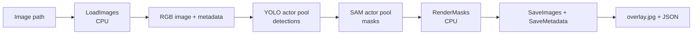

# YOLO → SAM Benchmark

`YoloSamBench` composes object detection and segmentation as a real multi-model graph. YOLO and SAM live in separate persistent Ray actor pools, allowing different images to occupy different stages concurrently while avoiding model reload for every batch.

## Topology



Stages preserve per-image alignment across multiple output Ports. In CUDA mode, `yolo_replicas=2` and `sam_replicas=2` reserve four GPUs concurrently by default, so replica counts should reflect both cluster capacity and the relative speed of the two models.

## Run

Prepare input images, YOLO weights, a SAM checkpoint, and the dependencies listed in `env.json`:

```python
from rayorch.benchmark import YoloSamBench

bench = YoloSamBench(
    input_path="/shared/images",
    output_dir="/shared/yolo-sam-output",
    yolo_model="/shared/models/yolo.pt",
    sam_checkpoint="/shared/models/sam_vit_b.pth",
    input_limit=100,
    yolo_replicas=2,
    sam_replicas=2,
    batch_size=4,
    input_batch_size=16,
    max_active_input_batches=2,
)

report = bench.run(ray_address="auto")
```

For a CPU smoke test, use `device="cpu"` and normally one replica for each model. To place model stages in separate environments or on selected nodes, override `runtime_env`, custom resources, or GPU counts through `stage_options["yolo"]` and `stage_options["sam"]`.

## Outputs and metrics

Each image produces `<stem>.overlay.jpg` and `<stem>.json`. `report.outputs` includes input path, output path, `yolo_boxes`, and `sam_masks`; added workload metrics are `images`, `detections`, and `masks`.

## What performance it demonstrates

| Observation | Where to read it | Question answered |
| --- | --- | --- |
| end-to-end image throughput | `images / measured_wall_s` | images per second through detection, segmentation, rendering, and storage |
| model-pool balance | compare YOLO and SAM Call time, RPCs, and average batch | which model limits throughput and whether replica ratios are appropriate |
| pipeline parallelism | increase input count and active input batches | whether overlapping YOLO, SAM, and CPU work across images improves throughput |
| batching efficiency | model Call batch statistics | whether configured batches fill or the workload is too small |
| output complexity | `detections` and `masks` | explain work variation caused by image content; these counts are not throughput by themselves |

Scan `(yolo_replicas, sam_replicas)` on the same image set instead of assuming equal counts are optimal. Storage bandwidth and automatic-mask count can dominate, so reports should state storage type, model variants, image resolution, and thresholds.
