# 嵌套文档拓扑 Benchmark

`DocumentTopologyBench` 是无模型、无数据集依赖的嵌套 `1 → M → 1` 参考负载。一个文档展开为页面，每个页面又展开为数量可变的 TableJob，表格先归并回页面，页面再归并回文档；生成数据还刻意包含零表格页面，用于验证空分组也能正确完成。

## 拓扑

```mermaid
flowchart LR
    Doc["Document"] --> Parse["ParseDocuments"]
    Parse --> ExpandPage["F.expand"]
    ExpandPage --> Page["Page Domain"]
    Page --> Layout["LayoutPages"]
    Layout --> OCR["OcrPages"]
    OCR --> Post["PostprocessPages"]
    Post --> ExpandTable["F.expand"]
    ExpandTable --> Job["TableJob Domain<br/>可能为空"]
    Job --> Table["TableCore"]
    Table --> ReduceTable["F.reduce<br/>TableJob → Page"]
    ReduceTable --> PageAssemble["ReducePage"]
    PageAssemble --> ReducePage["F.reduce<br/>Page → Document"]
    ReducePage --> DocAssemble["ReduceDocument"]
```



## 运行

```python
from rayorch.benchmark import DocumentTopologyBench

report = DocumentTopologyBench(
    output_dir="./results",
    document_count=8,
    pages_per_document=6,
    tables_per_page=2,
    workers=4,
    batch_size=8,
    input_batch_size=1,
    max_active_input_batches=4,
).run(profile=False)
```

输入和输出完全确定，不需要外部文件、模型或 GPU，因此它是验证安装、Ray 集群连通性和调度回归的首选案例。

## 输出与指标

每个输出包含文档名、有序页面 ID，以及每页的有序表格 ID；报告额外提供总 `pages` 和 `tables`。

## 体现什么性能

| 观察项 | 实验方式 | 能回答的问题 |
| --- | --- | --- |
| 框架与调度开销 | 固定总 Grain 数，测 `measured_wall_s` 与 RPC 数 | 在 UDF 几乎不耗时时，运行时本身的成本是多少 |
| 嵌套展开规模 | 增大 pages 和 tables | 两层动态 Domain 的调度成本如何增长 |
| 空分组路径 | 保留生成器中的零表格页面 | 空成员集合能否无死锁地立即归并 |
| 输入窗口 | 扫描 `max_active_input_batches` | 更多文档并发是否提升组批和流水线重叠 |
| Worker 扩展 | 扫描 `workers` 和 `batch_size` | 轻量任务何时被 Actor/RPC 开销主导 |

这个案例测的是正确性和控制面开销，不应当被描述为生产文档解析吞吐。由于 UDF 很轻，增加 Worker 可能反而变慢，这恰好可以显示任务粒度过细时的调度成本。
