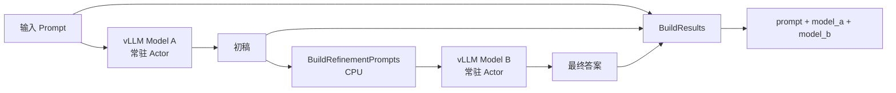

# 双 vLLM Benchmark

`DualVllmBench` 在一条显式 Pipeline 中串联两个常驻 vLLM 引擎：模型 A 先生成初稿，中间 CPU 阶段构造 refinement prompt，模型 B 再生成最终答案。它适合表示审阅、改写、验证或多模型级联，而不是把两个模型调用隐藏在一个 UDF 内部。

## 拓扑



两个模型 Actor 会同时常驻；当 `tensor_parallel_size=N` 时，每个 Actor 请求 N 张 GPU，因此默认总需求是 `2 × N` 张 GPU。即使两个模型路径相同，它们仍是两个独立引擎实例。

## 运行

`input_path` 可以是每行一个 Prompt 的文本文件，也可以是字符串行或包含 `prompt` 字段的 JSONL：

```python
from rayorch.benchmark import DualVllmBench

bench = DualVllmBench(
    input_path="/shared/prompts.jsonl",
    output_dir="/shared/dual-vllm-output",
    model_a="/shared/models/model-a",
    model_b="/shared/models/model-b",
    input_limit=100,
    tensor_parallel_size=1,
    batch_size=8,
    input_batch_size=32,
    max_active_input_batches=1,
    max_tokens=128,
)

report = bench.run(ray_address="auto")
```

如果两个模型需要落在不同节点或 Conda 环境，可分别覆盖 `stage_options["model_a"]` 与 `stage_options["model_b"]`。

## 输出与指标

每条输出包含原始 `prompt`、`model_a` 初稿和 `model_b` 最终答案。报告额外记录 `prompts`、`model_a_characters` 与 `model_b_characters`。

## 体现什么性能

| 观察项 | 如何读取 | 能回答的问题 |
| --- | --- | --- |
| 端到端 Prompt 吞吐 | `prompts / measured_wall_s` | 两阶段生成链路每秒完成多少请求 |
| 阶段占比 | 比较 `model_a`、`prompt`、`model_b` Call 耗时 | 哪个模型或中间处理是主瓶颈 |
| 模型组批 | 两个模型 Call 的 RPC、Grain 和 batch 统计 | 两个引擎是否都形成了足够大的批次 |
| 启动成本 | 比较 `startup_s` 与 `measured_wall_s` | 双模型加载对一次性任务有多大影响 |
| 输出工作量 | 生成字符数 | 在相同 tokenizer 和生成配置下解释耗时变化，但不能替代 tokens/s |

由于模型 B 依赖模型 A 的逐项结果，这个图主要展示跨输入流水线并行，而不是单个请求内部的并行。比较方案时必须固定 Prompt、`max_tokens`、temperature、模型版本和 tensor parallel 配置。
