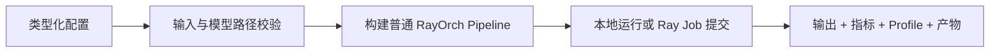

# Benchmarks 总览

RayOrch Benchmark 不是另一套执行框架，而是把一条普通 `Pipeline` 包装成可配置、可重复、可提交并自动记录结果的实验入口。所有内置案例都沿用同一条链路：构造 Benchmark 配置，加载输入，创建 Pipeline，本地连接 Ray 或通过 Ray Job 提交，最后生成统一的 `BenchmarkReport`。



## 选择一个案例

| Benchmark | 类型 | 核心拓扑 | 主要观察点 |
| --- | --- | --- | --- |
| [`MinerUBench`](mineru.md) | 真实模型 | PDF → Page → MinerU → Document | 页面吞吐、多 GPU 扩展、跨 PDF 组批、保序重建 |
| [`YoloSamBench`](yolo-sam.md) | 真实模型 | Image → YOLO → SAM → Save | 串联模型池的吞吐平衡、阶段瓶颈、端到端图像吞吐 |
| [`DualVllmBench`](dual-vllm.md) | 真实模型 | Prompt → vLLM A → vLLM B | 双引擎串联、模型阶段耗时与批处理效率 |
| [`SglangVllmBench`](sglang-vllm.md) | 真实模型 | Prompt → SGLang → vLLM | 跨 Conda 环境的调度开销与稳定性 |
| [`DocumentTopologyBench`](document-topology.md) | 无依赖拓扑 | Document → Page → TableJob → Document | 两层动态展开、空分组、有序归并与调度开销 |
| [`VideoCaptionTopologyBench`](video-caption.md) | 无依赖拓扑 | Video → Frame → Caption → Video | `1 → M → 1`、跨视频组批、帧级并行 |
| [`VideoMultimodalTopologyBench`](video-multimodal.md) | 无依赖拓扑 | Video → Audio + Frame → Merge | 两条异构分支独立推进后按父项汇合 |

真实模型案例用于观察完整负载行为；三个 topology 案例使用确定性 UDF，不需要数据集、模型或 GPU，更适合第一次运行、CI、调度语义回归和框架开销实验。Topology 案例不代表生产级 Docling、VLM 或 ASR 适配器。

## 最短运行路径

```python
from rayorch.benchmark import DocumentTopologyBench

report = DocumentTopologyBench(output_dir="./results").run(profile=False)
report.print_summary()
```

导入 `rayorch.benchmark` 时不会加载 vLLM、SGLang、MinerU 或视觉模型依赖；注册表只保存类路径，真正运行对应 Benchmark 时才导入实现。

## Benchmark 报告回答什么问题

每次运行都会记录 `startup_s`、`measured_wall_s`、`end_to_end_wall_s`、Actor 数、RPC 数、峰值活跃输入批次数，以及每个 Call 的 Grain、批大小和执行耗时统计；具体负载还会增加页面数、帧数、检测框数、mask 数或生成字符数等业务工作量。请先阅读[解读性能结果](performance.md)，避免把输出规模指标误当成吞吐，或把 Driver 可见 GPU 采样误当成集群级监控。

## 下一步

- 第一次运行：[运行 Benchmark](run.md)
- 理解结果：[解读性能结果](performance.md)
- 发布自己的实验：[编写 Benchmark](write.md)
