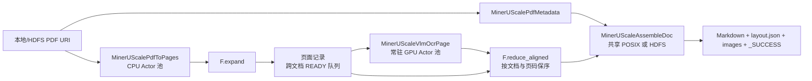

# MinerU Scale Benchmark（真实负载）

> **真实负载：** `MinerUScaleBench` 会读取真实 PDF，使用常驻 vLLM GPU Actor
> 加载真实 MinerU 2.5 模型，执行页面推理，并写出真实 Markdown、版面 JSON、抽取图片
> 和文档提交标记。它不是合成拓扑，也不是只测调度器的 Benchmark。

`MinerUScaleBench` 是 [`MinerUBench`](mineru.md) 的大规模化版本：两者都表达
PDF → Page → OCR → Document，但 Scale 版针对长时间、本地多卡和多机 GPU 任务加强了
输入、Actor 初始化、输出提交及资源配置。

## Scale 版增加了什么

| 能力 | 行为 |
| --- | --- |
| 本地与 HDFS 输入 | 接受一个或多个 PDF、目录或 `hdfs://` 根路径；确定性发现并拒绝重复 stem |
| 稳健渲染 | PDF 读取失败时重试，并刷新缓存的 HDFS filesystem client |
| 节点安全的 vLLM Actor | 每个节点串行初始化 vLLM，并为进程分配不重叠的端口段 |
| 分数 GPU 布局 | 分别配置 OCR 副本数和每个 Actor 的 GPU 配额 |
| 原子输出 | Markdown、layout JSON 和图片完整后才发布 `_SUCCESS` |
| 断点复用 | 重跑时校验已提交文档并复用完整结果 |
| 可复现报告 | 记录配置、Actor/RPC/batch、文档/页面、失败和吞吐指标 |
| 直接 CLI | 不修改 RayOrch 或负载源码常量即可运行 |

## 拓扑



来自不同 PDF 的页面可以进入同一个 OCR RPC。保持多个输入批次同时活跃的主要目的，
就是给跨文档组批提供足够多的 READY 页面，而不必等待某一个 PDF 的所有页面完成。

## 前置条件

- 带 GPU 节点的 Ray 集群，以及足以容纳所有常驻 Actor 池的 CPU；
- MinerU 模型在所有候选 GPU 节点上以相同路径可见；
- 每个 Actor 都能 `import flash_mineru`；
- 已安装 vLLM、`mineru-vl-utils`、Pillow 和负载 `env.json` 中的依赖；
- 使用 `hdfs://` 输入或输出时，PyArrow 与 HDFS client 配置可用；
- 业务输出使用共享 POSIX/Ceph 路径或 HDFS URI，Benchmark 报告目录对 Driver 可见。

Benchmark 不负责下载模型、上传数据或创建 Ray 集群；运行前需要先准备这些资源。

## 直接运行

同一个入口既可以连接本地 Ray，也可以连接已有集群：

```bash
python -m rayorch.benchmarks.mineru_scale \
  --input /shared/pdfs \
  --model /shared/models/MinerU2.5-2509-1.2B \
  --output /shared/results/mineru-scale \
  --artifact-dir /shared/results/mineru-scale-reports \
  --ray-address auto
```

可以重复传入 `--input` 合并多个输入根路径；使用 `--input-limit` 做 smoke 或候选参数
筛选。性能对比时，每个候选应使用新的输出目录，避免断点复用改变输出阶段的实际工作量。

### 4×H20 实验

下面的保守布局在每张 96GB H20 上放置一个 OCR Actor：

```bash
python -m rayorch.benchmarks.mineru_scale \
  --input /shared/pdfs \
  --input-limit 48 \
  --model /shared/models/MinerU2.5-2509-1.2B \
  --output /shared/results/mineru-scale-4h20 \
  --artifact-dir /shared/results/mineru-scale-4h20-reports \
  --render-replicas 16 \
  --ocr-replicas 4 \
  --assemble-replicas 4 \
  --batch-size 64 \
  --input-batch-size 24 \
  --max-active-input-batches 3 \
  --gpu-memory-utilization 0.8 \
  --gpus-per-ocr-actor 1 \
  --ray-address auto
```

一次真实本地验证在 4×H20 上处理了 48 个 PDF / 867 页，没有失败文档：

| 指标 | 实测值 |
| --- | ---: |
| 完成文档 | 48 / 48 |
| 页面 | 867 |
| Pipeline 实测耗时 | 136.860 s |
| 页面吞吐 | 6.335 pages/s |
| OCR RPC | 18 |
| 平均 OCR 页面/RPC | 48.17 / 64 |
| OCR batch 填充率 | 75.26% |
| Actor/模型启动 | 551.215 s |

该次运行使用 Ray 2.58.0、vLLM 0.10.0、Torch 2.7.1 和
`mineru-vl-utils` 1.2.1。

## 64-GPU 参考默认值

默认构造参数记录了已完成的 8 节点 × 8-H20 实验形态：

| 参数 | 默认值 |
| --- | ---: |
| `render_replicas` | 256 |
| `ocr_replicas` | 128 |
| `gpus_per_ocr_actor` | 0.5 |
| OCR GPU 总配额 | 64 |
| `assemble_replicas` | 64 |
| `batch_size` | 64 页 |
| `input_batch_size` | 24 PDF |
| `max_active_input_batches` | 24 |
| `gpu_memory_utilization` | 0.32 |
| `render_dpi` | 200 |

参考运行处理了 3,690 个 PDF / 174,744 页，吞吐为 48.1738 pages/s，报告了
1 个失败文档。环境为 Ray 2.51.1、vLLM 0.11.0、Torch 2.8.0+cu128、
PyArrow 19.0.1 和 64 张 H20；精确溯源记录在 Benchmark 目录的
`success_contract.json`。

默认 Actor 计划会申请 449 个 Actor CPU（`256 + 128 + 64 + 1`）。如果集群不能
容纳，启动前必须降低 render 和 assemble 副本；否则 Ray 会让 Actor 保持 pending，
不会静默缩小资源池。

## Python API

```python
from rayorch.benchmark import MinerUScaleBench


bench = MinerUScaleBench(
    input_paths=(
        "hdfs://namenode/path/to/pdfs-a",
        "hdfs://namenode/path/to/pdfs-b",
    ),
    model="/shared/models/MinerU2.5-2509-1.2B",
    output_dir="/shared/results/mineru-scale",
    artifact_dir="/shared/results/mineru-scale-reports",
    render_replicas=256,
    ocr_replicas=128,
    gpus_per_ocr_actor=0.5,
    assemble_replicas=64,
    batch_size=64,
    input_batch_size=24,
    max_active_input_batches=24,
    gpu_memory_utilization=0.32,
)

report = bench.run(ray_address="auto")
report.print_summary()
```

也可以通过标准 Benchmark API 调用 `submit()`。输入、模型、业务输出和报告路径必须在
执行环境中可见；源码上传不会顺便上传这些大体积资源。

## 输出与断点协议

每个文档写入：

```text
<output>/<pdf-stem>/
  _SUCCESS
  vlm/
    <pdf-stem>.md
    layout.json
    images/
```

只有 `_SUCCESS` 合法时文档才算完成。共享文件系统写入时，组装过程保留
`.rayorch-incomplete`；HDFS 写入先进入 staging 目录，再移动到最终路径。重跑时会校验
提交信息并复用完整文档。

标准报告位于：

```text
<artifact-dir>/<run-id>/
  config.json
  summary.json
  gpu_samples.jsonl
```

`summary.json` 在通用指标之外增加 `documents`、`failed_documents`、`pages` 和
`pages_per_s`。

## 参数设置建议

建议按以下顺序调参：

1. 先用 1～2 个 PDF 验证输出；
2. 根据 GPU 数量和显存确定 OCR Actor 布局；
3. 依次扫描 `batch_size=32/64/96/128`；
4. 增大 `max_active_input_batches`，直到 OCR 组批不再改善；
5. 只有 OCR 等待页面时才增加 render 副本；
6. 根据真实共享存储能力调整 assemble 副本。

Benchmark 目录中包含 `mineru-scale-tuning` Codex Skill 和确定性参数推荐脚本。注意：其推荐参数不代表是最优值，只是根据历史测试经验的推测值。
