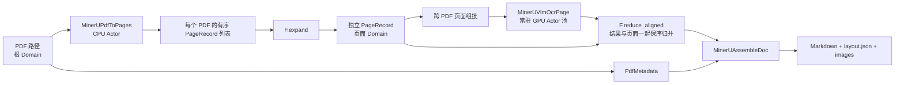

# MinerU PDF Benchmark

`MinerUBench` 是内置案例中最完整的真实模型负载：一个 PDF 动态展开成数量不等的页面，CPU Actor 负责渲染，常驻 GPU Actor 运行 MinerU 2.5 与 vLLM，页面结果即使乱序完成，也会按原 PDF 和页码归并后再生成 Markdown、版面 JSON 和图片。

如果需要本地/HDFS 多输入、分数 GPU Actor、原子文档提交、断点复用和已验证的大规模
配置，请使用 [`MinerUScaleBench`](mineru-scale.md)。

## 拓扑



这个案例重点不是简单的 PDF 循环，而是允许多个长短不同的 PDF 独立推进：只要某些页面已经 READY，就可以跨 PDF 组成模型批次；某个 PDF 的页面全部完成后即可立即组装，不必等待其他 PDF。

## 运行

输入可以是单个 PDF 或包含 PDF 的目录，模型、输入和输出路径必须在所有可能执行该阶段的 Ray 节点上以相同路径可见。

```python
from rayorch.benchmark import MinerUBench

bench = MinerUBench(
    input_path="/shared/pdfs",
    output_dir="/shared/mineru-output",
    model="/shared/models/MinerU2.5",
    input_limit=100,
    num_gpus=8,
    batch_size=64,
    input_batch_size=24,
    max_active_input_batches=3,
)

report = bench.run(ray_address="auto")
report.print_summary()
```

少量高级阶段配置可以从外部覆盖，而不需要修改 Benchmark 源码：

```python
bench = MinerUBench(
    input_path="/shared/pdfs",
    output_dir="/shared/mineru-output",
    model="/shared/models/MinerU2.5",
    num_gpus=8,
    stage_options={
        "render": {"replicas": 4, "num_cpus": 2},
        "ocr": {"batch_size": 32},
        "assemble": {"replicas": 2},
    },
)
```

## 输出与指标

每个输出记录包含 `pdf`、`md_path`、`chars` 和 `pages`；业务产物位于 `output_dir/<pdf>/vlm/`，标准报告位于 `output_dir/.rayorch-benchmark/<run-id>/`。除通用执行指标外，报告直接提供 `pages` 和 `pages_per_s`。

## 体现什么性能

| 观察项 | 如何读取 | 能回答的问题 |
| --- | --- | --- |
| 页面吞吐 | `metrics.pages_per_s` | 整条 PDF 流水线每秒完成多少页 |
| GPU 扩展 | 固定数据和 batch，改变 `num_gpus` | 增加常驻 OCR Actor 是否带来近似线性收益 |
| 模型组批 | 查看 OCR Call 的 RPC、Grain 和 batch 统计 | 页面是否足够多、输入窗口是否足够大，GPU batch 是否吃满 |
| CPU/GPU 平衡 | 比较 render、OCR、assemble 的 Call 耗时 | 渲染或组装是否让 GPU 等待，或 GPU 是否成为主瓶颈 |
| 长短文档调度 | 混合不同页数 PDF，观察总耗时与完成顺序 | 完成驱动调度是否避免短 PDF 被长 PDF 阻塞 |

推荐先固定 PDF 集合，分别扫描 `batch_size`、`max_active_input_batches` 和 `num_gpus`，每组参数预热后重复多次并报告中位数。共享存储读取速度、PDF 页尺寸、模型版本和 GPU 型号都会显著影响结果，发布性能数字时必须一并说明。
