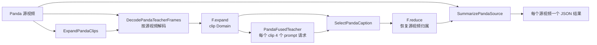

# Panda-70M 视频描述 Benchmark

`Panda70MBench` 将 Panda-70M 验证集视频描述负载封装为 RayOrch
Benchmark。每个源视频保留自己的 clip 归属，系统为每个 clip 解码四个时间
位置的帧，由一个融合的 Qwen2.5-VL teacher 生成四个描述候选，最后把选中的
clip 结果归并回源视频。

实现位于
[`rayorch/benchmarks/panda70m`](https://github.com/OpenDCAI/RayOrch/tree/udf/video/rayorch/benchmarks/panda70m)。
该目录包含普通 UDF、声明式 Pipeline、类型化 Benchmark 入口和 Ray Job
环境清单。

## 拓扑



`DecodePandaTeacherFrames` 同时接收源视频和 clip 分组，因此一次 decode 调用
仅仅打开一份共享源文件。随后使用 `F.expand` 为每个解码后的 clip 建立独立调度
身份。`PandaFusedTeacher` 将四个 prompt 位置放入一次 vLLM 请求批次，每个 Actor
每个 Actor 会在后续批次中复用已经加载的模型。

## Manifest

Manifest 是包含 `sources` 数组的 JSON 对象。每个源视频需要稳定的
`source_id` 和非空的 `clips` 数组。每个 clip 使用有序的 `clip_index` 和共享媒体
`path`：

```json
{
  "sources": [
    {
      "source_id": "video-0001",
      "clips": [
        {
          "clip_index": 0,
          "path": "/shared/videos/video-0001.mp4",
          "clip_start_fraction": 0.0,
          "clip_end_fraction": 1.0,
          "reference_caption": "a person opens a door"
        }
      ]
    }
  ]
}
```

`clip_start_fraction` 与 `clip_end_fraction` 指定四个 teacher 帧所在的时间区间。
`reference_caption` 可以省略；存在时，输出会记录 reference F1 诊断值。
媒体路径可以使用 `hdfs://`。当 Driver 能读取 Manifest、视频数据仅仅挂载在 Worker
节点时，设置 `RAYORCH_DEFER_LOCAL_PATH_CHECK=1`。

## 本地运行或连接已有 Ray 集群

```python
from rayorch.benchmark import Panda70MBench

bench = Panda70MBench(
    manifest="/shared/panda70m/val.audit.json",
    output_dir="/shared/results/panda70m",
    model="Qwen/Qwen2.5-VL-7B-Instruct",
    input_limit=100,
    teacher_batch_size=8,
    teacher_replicas=2,
    decode_replicas=4,
    decode_backend="opencv",
    long_edge=448,
    input_batch_size=2,
    max_active_input_batches=2,
)

report = bench.run(ray_address="auto", profile=True)
report.print_summary()
```

每个 teacher Actor 申请一个 GPU。`teacher_replicas=2` 时，融合 teacher 阶段会
创建八个常驻 GPU Actor，分别对应四个 prompt 位置与两个副本。每个 Worker
节点都需要能够读取模型权重和媒体路径。

本地逻辑检查可以使用小型 Manifest 并设置 `profile=False`。模型、视频文件、
CUDA 运行环境和 `env.json` 中的依赖仍然需要准备。

## 通过 Ray Job 提交

```python
from rayorch.benchmark import LocalSource

run = bench.submit(
    "http://ray-head:8265",
    source=LocalSource(
        project_root="/path/to/RayOrch",
        modules=("/path/to/RayOrch/rayorch",),
    ),
)
report = run.wait(timeout_s=3600)
```

当 `LocalSource.install_dependencies` 开启时，提交过程会安装
[`env.json`](https://github.com/OpenDCAI/RayOrch/blob/udf/video/rayorch/benchmarks/panda70m/env.json)
中声明的依赖。输入、模型权重、输出和报告目录仍需要使用共享存储。

## 参数

| 参数 | 含义 |
| --- | --- |
| `teacher_batch_size` | 一次融合 teacher 批次接收的 clip 数量 |
| `teacher_replicas` | 四个 prompt 位置各自使用的副本数 |
| `decode_replicas` | CPU decode Actor 副本数 |
| `decode_backend` | `opencv` 用于本地或已物化的 HDFS 媒体，`pyav` 用于随机访问流 |
| `long_edge` | 传给 VLM 的解码帧最长边 |
| `input_batch_size` | 一个输入生命周期接收的源视频数量 |
| `max_active_input_batches` | 同时运行的源视频生命周期数量 |
| `sample_multiplier` | 扩展实验使用的确定性 Manifest 遍历次数 |
| `stage_options` | `expand`、`decode`、`teacher`、`select`、`summarize` 阶段的 Ray 选项 |

默认 selector 仅仅使用输入内容进行选择：它根据 caption 长度和 token 多样性计分。
Reference caption 仅仅用于诊断指标，不参与选择过程。

## 输出与指标

标准报告位于：

```text
<output_dir>/.rayorch-benchmark/<run-id>/
  config.json
  summary.json
  gpu_samples.jsonl
```

`SummarizePandaSource` 还会在 `output_dir` 下为每个源视频写入一个 JSON 文件。
文件包含有序 clip 选择结果、选中的 role 与 caption、候选 caption，以及可用时
的 chosen/oracle reference F1。报告在 RayOrch 通用指标基础上增加 `sources`、
`clips`、`mean_chosen_reference_f1` 和 `mean_oracle_reference_f1`。

Reference F1 仅仅表示实验中的词汇重叠诊断值，不能替代标准的视频描述质量评测。
