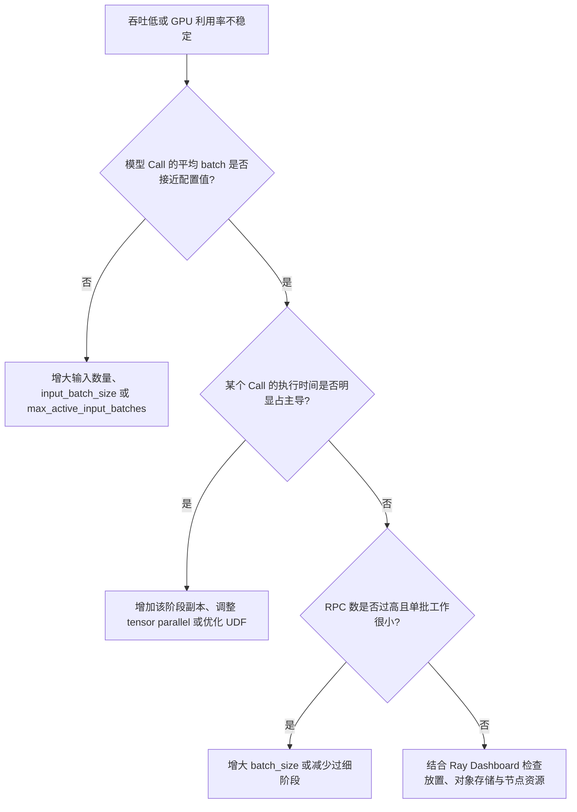

# 解读性能结果

Benchmark 的目的不是只给出一个总耗时，而是把业务工作量、RayOrch 调度行为和资源采样放在同一份报告中，帮助判断瓶颈位于模型、批处理、Actor 数量、输入窗口还是拓扑本身。

## 通用指标

| 字段 | 含义 | 常见判断方式 |
| --- | --- | --- |
| `startup_s` | 创建 Executor、Actor 和加载模型的启动时间 | 模型很大时应与稳态执行耗时分开分析 |
| `measured_wall_s` | `Executor.run()` 的实际执行时间 | 计算吞吐时优先使用该字段 |
| `end_to_end_wall_s` | 从创建 Executor 到执行完成的总时间 | 适合衡量一次性任务的真实用户等待时间 |
| `actor_count` | 本次图中创建的 Actor 总数 | 检查副本配置是否与预期一致 |
| `rpc_count` | Worker RPC 总数 | RPC 很多而平均 batch 很小时，通常需要调整组批或输入窗口 |
| `peak_active_input_batches` | 同时活跃的输入批次峰值 | 判断 `max_active_input_batches` 是否真正扩大了流水线窗口 |
| `calls` | 每个 Pipeline Call 的 Actor、RPC、Grain、batch 和耗时统计 | 定位最慢阶段、批次是否吃满，以及阶段间是否失衡 |
| `released_values` | 运行时提前释放的中间值数量 | 用于观察数据生命周期，不等同于节省的字节数 |

## 计算业务吞吐

统一写法是：

```text
业务吞吐 = 完成的业务工作量 / measured_wall_s
```

例如 MinerU 已直接给出 `pages_per_s`；YOLO → SAM 可以用 `images / measured_wall_s`；视频案例可以用 `frames / measured_wall_s`。LLM 案例当前记录字符数而不是 token 数，因此只能用于同一 tokenizer、同一生成配置下的粗略比较，不能宣称为标准 tokens/s。

## 比较实验时必须固定什么

- 相同输入集合、输入顺序和 `input_limit`；
- 相同模型、精度、CUDA/驱动、后端版本和生成参数；
- 相同 Ray 集群节点与 GPU 型号；
- 相同 `batch_size`、`input_batch_size`、`max_active_input_batches` 和副本数，除非它们正是实验变量；
- 至少一次预热或明确分别报告冷启动与稳态运行；
- 多次重复并报告中位数或分位数，而不是只保留最快结果。

## 如何定位瓶颈



## Profile 的边界

`gpu_samples.jsonl` 是 Driver 进程可见 GPU 的尽力采样，适合快速查看显存峰值和粗粒度利用率趋势，但不是多节点集群监控，也不会自动归因到某个 Actor。生产环境请结合 Ray Dashboard、Prometheus/Grafana 或部署平台的节点与进程指标。

## 性能表述原则

文档中的“体现什么性能”指这个 Benchmark 能测量和暴露哪些性能维度，不代表仓库预先承诺某个固定吞吐数字。真实结果必须注明硬件、软件版本、模型、数据、参数和运行次数；三个无依赖 topology 案例主要衡量调度正确性与框架开销，不代表真实模型业务吞吐。
