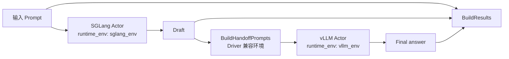

# SGLang → vLLM 跨环境 Benchmark

`SglangVllmBench` 是跨环境执行的最小真实模型案例：SGLang 与 vLLM 分别运行在自己的 Conda 环境和持久化 Actor 中，RayOrch 只在阶段之间传递普通 Python 值，不要求两个推理后端共享同一套依赖。

## 拓扑



这里没有 RayOrch 私有环境注册表；`sglang_env` 和 `vllm_env` 最终就是 Ray 原生 `runtime_env={"conda": ...}`。两个环境必须包含兼容版本的 Python、Ray、RayOrch 以及各自推理后端，并在所有候选节点上存在。

## 运行

```python
from rayorch.benchmark import SglangVllmBench

bench = SglangVllmBench(
    input_path="/shared/prompts.jsonl",
    output_dir="/shared/sglang-vllm-output",
    model="/shared/models/Qwen3-0.6B",
    sglang_env="rayorch-sglang",
    vllm_env="rayorch-vllm",
    input_limit=100,
    sglang_tensor_parallel_size=1,
    vllm_tensor_parallel_size=1,
    batch_size=8,
    max_tokens=128,
)

report = bench.run(ray_address="auto")
```

通过 Ray Job 提交源码 checkout 时，应让两个 Actor 环境提前安装各自依赖，并使用 `LocalSource(..., install_dependencies=False)`，避免在 Driver 环境混装 SGLang 与 vLLM。

## 输出与指标

每条输出包含 `prompt`、`sglang` draft 与 `vllm` 最终答案；额外指标为 `prompts`、`sglang_characters` 和 `vllm_characters`。

## 体现什么性能

| 观察项 | 如何读取 | 能回答的问题 |
| --- | --- | --- |
| 跨环境端到端吞吐 | `prompts / measured_wall_s` | 两个独立软件栈串联后每秒完成多少请求 |
| 环境与模型冷启动 | `startup_s` | Conda Actor 初始化和模型加载对一次性运行的影响 |
| 阶段瓶颈 | 比较 SGLang 与 vLLM Call 耗时和 batch | 哪个后端限制整体吞吐，两个 TP 配置是否平衡 |
| 环境边界开销 | 与同环境的双引擎基线对比 | `runtime_env` 隔离带来的额外启动或传输成本 |
| 稳定性 | 重复运行、检查失败与完成数 | 不同依赖栈能否在多节点上稳定创建和恢复 Actor |

这个案例首先验证“一个 Pipeline 跨两个真实环境仍能工作”，其次才比较后端速度。公平测量环境边界开销时，应使用相同模型和 Prompt，并把模型加载、首次编译与稳态执行分别报告。
