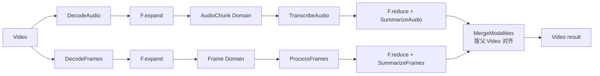

# 多模态视频拓扑 Benchmark

`VideoMultimodalTopologyBench` 展示同一个父 Video 下的两条兄弟分支：音频分支展开为 AudioChunk，视觉分支展开为 Frame，两边拥有不同基数和独立进度，各自有序归并回 Video Domain 后才执行最终 Merge。

## 拓扑



## 运行

```python
from rayorch.benchmark import VideoMultimodalTopologyBench

report = VideoMultimodalTopologyBench(
    output_dir="./results",
    video_count=8,
    frames_per_video=16,
    audio_chunks_per_video=6,
    workers=4,
    batch_size=8,
    input_batch_size=1,
    max_active_input_batches=4,
).run(profile=False)
```

## 输出与指标

每个输出包含视频名、有序音频 chunk ID 和有序帧 ID；报告额外提供 `audio_chunks` 与 `frames`。

## 体现什么性能

| 观察项 | 实验方式 | 能回答的问题 |
| --- | --- | --- |
| 分支并行 | 分别增大音频和视觉工作量 | 两条兄弟 Domain 是否能独立推进，而不是互相串行阻塞 |
| 分支失衡 | 设置不同的 chunks/frames 比例 | 较慢分支如何决定最终 Merge 的就绪时间 |
| 父级汇合 | 增大视频数和输入窗口 | 不同视频是否按各自血缘独立完成和合并 |
| 调度开销 | 比较单分支视频案例 | 增加第二个 Domain、Reduce 和 join 带来多少控制面成本 |

这个案例用于研究 DAG 形态和 join 行为，不是生产 ASR/VLM 基准。接入真实模型后，应分别为音频和视觉阶段配置资源、batch 与环境，并报告每条分支的工作量。
