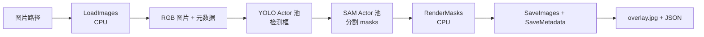

# YOLO → SAM Benchmark

`YoloSamBench` 把目标检测和分割串成一条真实的多模型图。YOLO 与 SAM 分别驻留在自己的 Ray Actor 池中，图片可以同时位于不同阶段，从而形成跨样本的流水线并行，而模型不会为每个批次重复加载。

## 拓扑



各阶段保持逐图片对齐的多输出 Port；`yolo_replicas=2` 与 `sam_replicas=2` 在 CUDA 模式下默认会同时预留 4 张 GPU，因此两组副本应根据集群资源和两个模型的相对速度共同配置。

## 运行

准备输入图片、YOLO 权重和 SAM checkpoint，并安装 `env.json` 中列出的依赖：

```python
from rayorch.benchmark import YoloSamBench

bench = YoloSamBench(
    input_path="/shared/images",
    output_dir="/shared/yolo-sam-output",
    yolo_model="/shared/models/yolo.pt",
    sam_checkpoint="/shared/models/sam_vit_b.pth",
    input_limit=100,
    yolo_replicas=2,
    sam_replicas=2,
    batch_size=4,
    input_batch_size=16,
    max_active_input_batches=2,
)

report = bench.run(ray_address="auto")
```

CPU 冒烟测试可使用 `device="cpu"` 并把两个副本数设为 1。需要为模型阶段指定不同环境或节点时，可以通过 `stage_options["yolo"]` 与 `stage_options["sam"]` 覆盖 `runtime_env`、自定义资源和 GPU 数量。

## 输出与指标

每张图片生成 `<stem>.overlay.jpg` 和 `<stem>.json`。`report.outputs` 包含输入路径、输出路径、`yolo_boxes`、`sam_masks` 等字段；额外业务指标包括 `images`、`detections` 和 `masks`。

## 体现什么性能

| 观察项 | 如何读取 | 能回答的问题 |
| --- | --- | --- |
| 端到端图片吞吐 | `images / measured_wall_s` | 完整检测、分割、渲染和写盘链路每秒完成多少图片 |
| 模型池平衡 | 比较 YOLO 与 SAM Call 的执行时间、RPC 和平均 batch | 哪个模型阶段限制流水线吞吐，副本比例是否合理 |
| 流水线并行 | 增大输入数和 active input batches 后观察吞吐 | 不同图片在 YOLO、SAM 和 CPU 后处理阶段重叠是否带来收益 |
| 组批效率 | 模型 Call 的 batch 统计 | `batch_size` 是否实际被填满，数据量是否过少 |
| 输出复杂度 | `detections`、`masks` | 解释输入内容变化带来的计算量差异；它们本身不是吞吐指标 |

建议以相同图片集分别扫描 `(yolo_replicas, sam_replicas)`，而不是盲目让两者保持相同。写盘速度和自动 mask 数量也可能主导结果，因此性能报告应包含存储类型、模型变体、分辨率和阈值。
